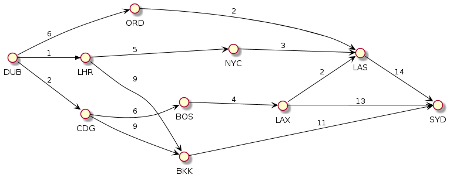
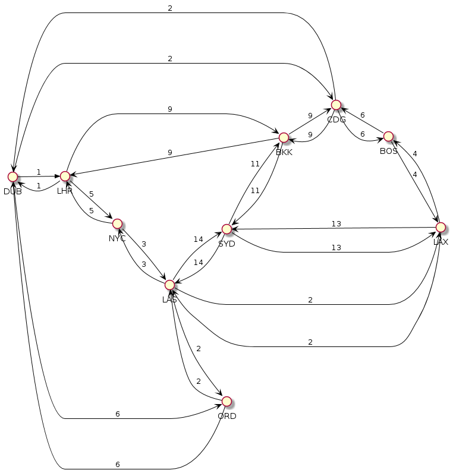

# Airport Routes challenge

## Problem analysis
The routes provided along with challenge description might impact the understanding of the problem. The provided routes cover only flights to same direction as per picture below.  So, considering only the routes, the problem is simpler than generic description. In the other side, considering that could exist routes connecting airports in both directions, the problem gets more complex.

## Two solutions
Because of these different point of views about the problem, the program cover each perspective with a different solution. Both solutions are built on top of graph algorithms.

### Assuming only the provided routes
In this case, the problem is faced as a Directed Acyclic Graph (DAG). The program creates a DAG based on the provided routes. Then, it generates a Topological Order on top of that and traverse the topological order searching for the shortest path between the departure and arrival informed airports.

### Extending with returning routes
In this case, the program duplicates each route creating a new route connecting same airports in the oposite direction as per picture below. So, the problem is faced as a Directed Cycle Graph. The program generates the graph from the extended routes an then applies a Dijkstra based algorithm able to find shortest paths in that kind of graph.

In order to run the program in this mode, a flag `with-returning-routes` should be informed as the third parameter after the airports. Then, paths like BKK -> ORD are made possible.

## How to execute

- Default mode (with provided routes): `java -jar ./airport-routes-finder-0.1.jar DUB SYD`
- Extended mode (with returning routes): `java -jar ./airport-routes-finder-0.1.jar DUB SYD with-returning-routes`

## Tests
### Unit tests
### Manual tests

## TODO
1. ~~SSSP based on Topological Sorting~~
1. ~~Expand initial options in the provided dataset~~
1. ~~Error messages~~
1. ~~Packaging~~
1. ~~Documentation for Directed Cycle Graph improved.~~
1. Refine FP
1. Fix topological parameters
1. Discuss approach (README)
1. Performance tests
